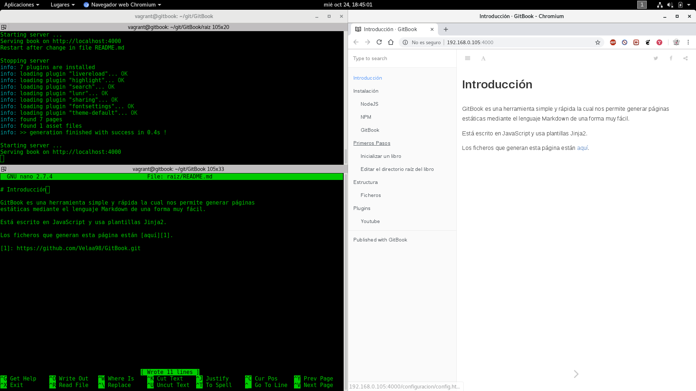

# Introducción
prueba

GitBook es una herramienta simple y rápida la cual nos permite generar páginas
estáticas mediante el lenguaje Markdown de una forma muy fácil.

Está escrito en JavaScript y usa plantillas Jinja2.

Los ficheros que generan esta página están [aquí][1].

En la siguiente imagen se puede ver la facilidad de uso y edición que nos aporta gitbook,
teniendo en una única pantalla todo lo que necesitamos para crear y probar el contenido
de nuestra página estática.

Estamos viendo el servidor de depuración sensible a cambios en los ficheros
 .md que incorpora GitBook, un editor de texto y la visión web de la página resultante.

[1]: https://github.com/Velaa98/GitBook.git 

